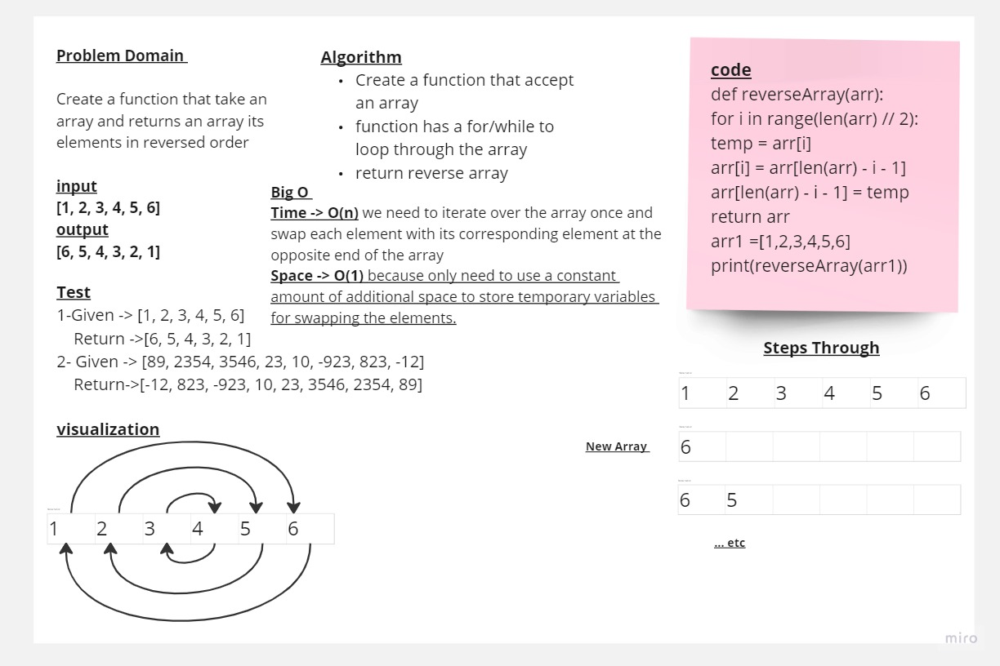

# Challenge array-reverse
<!-- Description of the challenge -->
Create a function that take an array and returns an array its elements in reversed order


## Whiteboard Process
<!-- Embedded whiteboard image -->


## Approach & Efficiency
<!-- What approach did you take? Why? What is the Big O space/time for this approach? -->
Big O 
Time -> O(n) we need to iterate over the array once and swap each element with its corresponding element at the opposite end of the array
Space -> O(1) because only need to use a constant amount of additional space to store temporary variables for swapping the elements.

## Solution
<!-- Show how to run your code, and examples of it in action -->
```python
def reverseArray(arr):
    for i in range(len(arr) // 2):
        temp = arr[i]
        arr[i] = arr[len(arr) - i - 1]
        arr[len(arr) - i - 1] = temp
    return arr

arr1 =[1,2,3,4,5,6]
print(reverseArray(arr1))
```