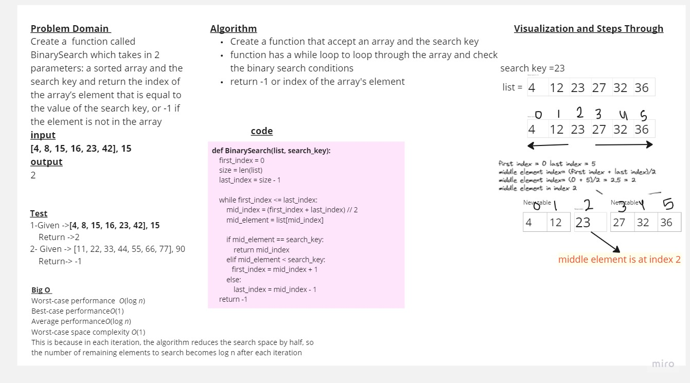

# Challenge Binary Search
 * Create a function that accept an array and the search key
function has a while loop to loop through the array and check the binary search conditions
return -1 or index of the array's element
## Whiteboard Process
<!-- Embedded whiteboard image -->


## Approach & Efficiency
<!-- What approach did you take? Why? What is the Big O space/time for this approach? -->
* Big O 
Worst-case performance  O(log n)
Best-case performanceO(1)
Average performanceO(log n)
Worst-case space complexity O(1)
This is because in each iteration, the algorithm reduces the search space by half, so the number of remaining elements to search becomes log n after each iteration
## Solution
<!-- Show how to run your code, and examples of it in action -->

code 
```python
def BinarySearch(list, search_key):
    first_index = 0
    size = len(list)
    last_index = size - 1
    
    while first_index <= last_index:
        mid_index = (first_index + last_index) // 2
        mid_element = list[mid_index]
        
        if mid_element == search_key:
            return mid_index
        elif mid_element < search_key:
           first_index = mid_index + 1
        else:
            last_index = mid_index - 1

    return -1
  
```