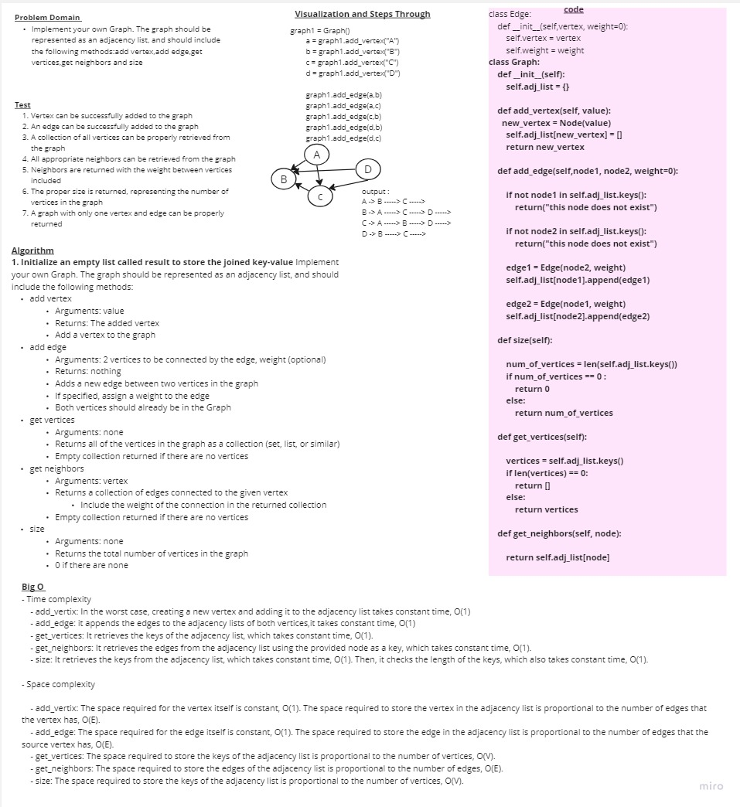

# Challenge Graph 

### Whiteboard Process

### Approach & Efficiency
- Time complexity 

    - add_vertix: In the worst case, creating a new vertex and adding it to the adjacency list takes constant time, O(1)
    - add_edge: it appends the edges to the adjacency lists of both vertices,it takes constant time, O(1)
    - get_vertices: It retrieves the keys of the adjacency list, which takes constant time, O(1).
    - get_neighbors: It retrieves the edges from the adjacency list using the provided node as a key, which takes constant time, O(1).
    - size: It retrieves the keys from the adjacency list, which takes constant time, O(1). Then, it checks the length of the keys, which also takes constant time, O(1).

- Space complexity

    - add_vertix: The space required for the vertex itself is constant, O(1). The space required to store the vertex in the adjacency list is proportional to the number of edges that the vertex has, O(E).
    - add_edge: The space required for the edge itself is constant, O(1). The space required to store the edge in the adjacency list is proportional to the number of edges that the source vertex has, O(E).
    - get_vertices: The space required to store the keys of the adjacency list is proportional to the number of vertices, O(V).
    - get_neighbors: The space required to store the edges of the adjacency list is proportional to the number of edges, O(E).
    - size: The space required to store the keys of the adjacency list is proportional to the number of vertices, O(V).

### Solution
https://github.com/asfantala/data-structures-and-algorithms/blob/main/graphs/graph/graph.py

