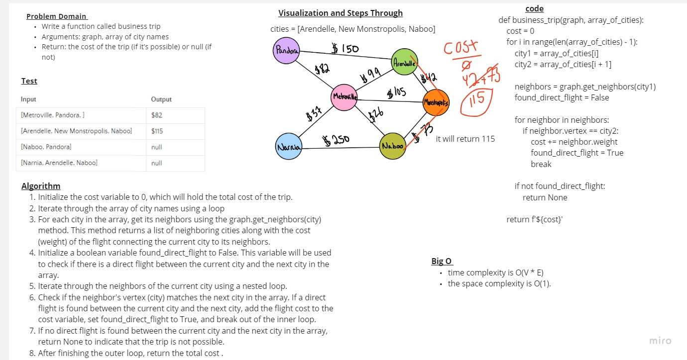

# Challenge Business trip


### Whiteboard Process


### Approach & Efficiency
- time complexity is O(V * E)
- space complexity is O(1).


### Solution

```
def business_trip(graph, array_of_cities):
    
    cost = 0

    for i in range(len(array_of_cities) - 1):
        city1 = array_of_cities[i]
        city2 = array_of_cities[i + 1]

        neighbors = graph.get_neighbors(city1)
        found_direct_flight = False

        for neighbor in neighbors:
            if neighbor.vertex == city2:
                cost += neighbor.weight
                found_direct_flight = True
                break

        if not found_direct_flight:
            return None

    return f'${cost}'


```

