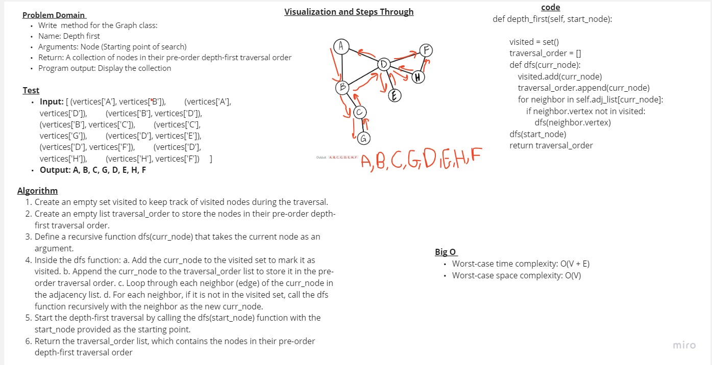

# Challenge Depth first search 


### Whiteboard Process


### Approach & Efficiency
- Worst-case time complexity: O(V + E)
- Worst-case space complexity: O(V)


### Solution

```
def depth_first(self, start_node):
        visited = set()
        traversal_order = []
        def dfs(curr_node):
            visited.add(curr_node)
            traversal_order.append(curr_node)
            for neighbor in self.adj_list[curr_node]:
                if neighbor.vertex not in visited:
                    dfs(neighbor.vertex)
        dfs(start_node)
        return traversal_order
```

