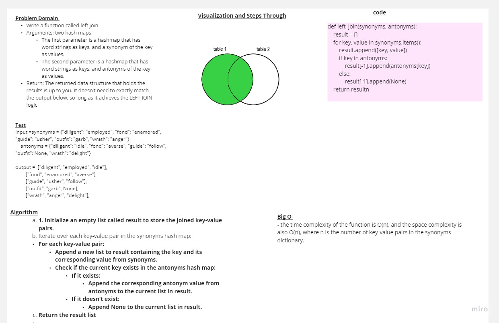

<!-- Description of the challenge -->
# Left Join  

## white board 



## Approach & Efficiency

- the time complexity of the function is O(n), and the space complexity is also O(n), where n is the number of key-value pairs in the synonyms dictionary.

## Solution : 
```
def left_join(synonyms, antonyms):

    result = []
    synonyms_keys = synonyms.keys()
    for key in synonyms_keys:
        value = synonyms.get(key)
        if antonyms.has(key):
            result.append([key, value, antonyms.get(key)])
        else:
            result.append([key, value, None])
    return result
```