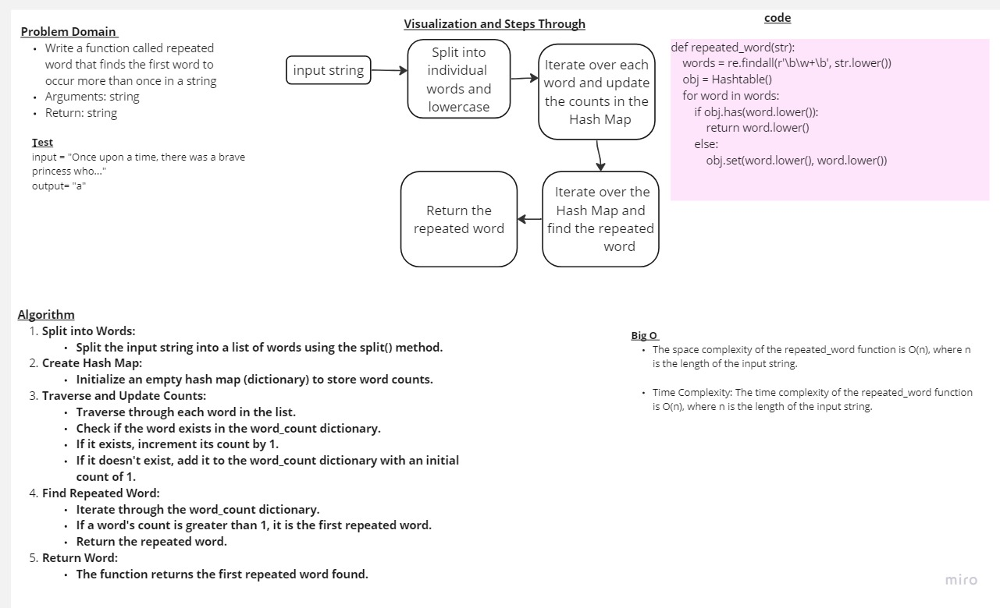

<!-- Description of the challenge -->
# Repeated Word  

## white board 

## Approach & Efficiency

- The space complexity of the repeated_word function is O(n), where n is the length of the input string.

- Time Complexity: The time complexity of the repeated_word function is O(n), where n is the length of the input strin

## Solution : 
```
def repeated_word(str):
    words = re.findall(r'\b\w+\b', str.lower())
    obj = Hashtable()
    for word in words:
        if obj.has(word.lower()):
            return word.lower()
        else:
            obj.set(word.lower(), word.lower())
```
