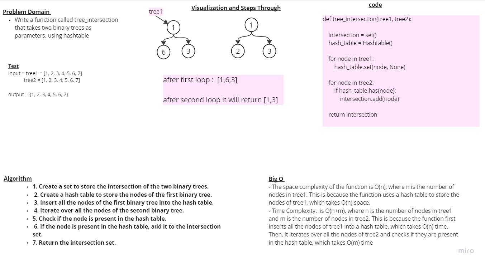

<!-- Description of the challenge -->
# Tree intersection  

## white board 



## Approach & Efficiency

- The space complexity of the function is O(n), where n is the number of nodes in tree1. This is because the function uses a hash table to store the nodes of tree1, which takes O(n) space.

- Time Complexity:  is O(n+m), where n is the number of nodes in tree1 and m is the number of nodes in tree2. This is because the function first inserts all the nodes of tree1 into a hash table, which takes O(n) time. Then, it iterates over all the nodes of tree2 and checks if they are present in the hash table, which takes O(m) time

## Solution : 
```
def tree_intersection(tree1, tree2):
   

    intersection = set()
    hash_table = Hashtable()

    for node in tree1:
        hash_table.set(node, None)

    for node in tree2:
        if hash_table.has(node):
            intersection.add(node)

    return intersection
```
