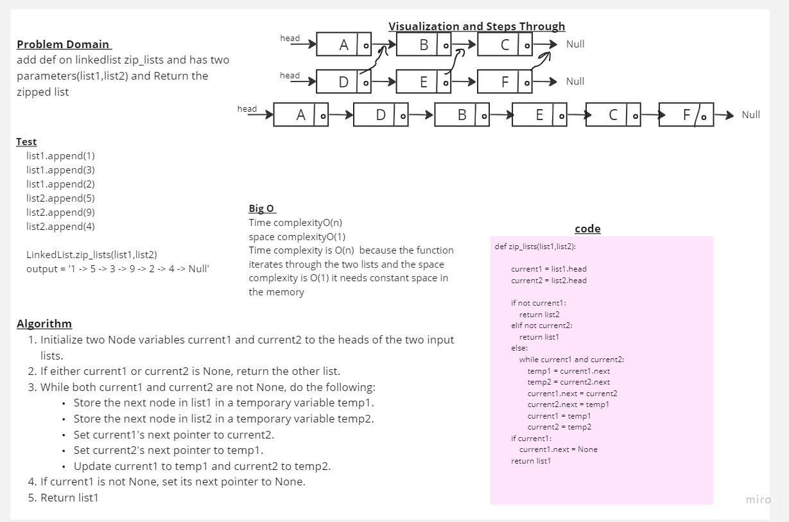

# Challenge 07

## Whiteboard Process
<!-- Embedded whiteboard image -->

## Approach & Efficiency
<!-- What approach did you take? Why? What is the Big O space/time for this approach? -->
Big O
|||
|-------|-----| 
|Time complexity  |   O(n)|
|space complexity |   O(1)|

 

## Solution
```
    def zip_lists(list1,list2):

        current1 = list1.head
        current2 = list2.head

        if not current1:
            return list2
        elif not current2:
            return list1
        else:
            while current1 and current2:
                temp1 = current1.next
                temp2 = current2.next
                current1.next = current2
                current2.next = temp1
                current1 = temp1
                current2 = temp2
        if current1:
            current1.next = None
        return list1

    
    ```